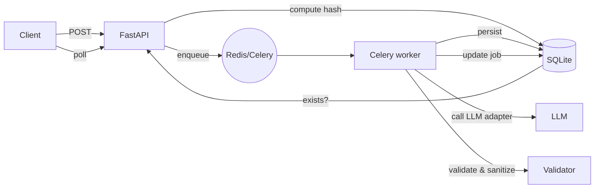

# Implementation Plan: InsightBoard Dependency Engine

Overview

Implement a robust backend (FastAPI + Python) that: accepts a transcript, uses a pluggable LLM adapter (mockable) to extract tasks in the strict JSON schema, sanitizes dependencies, detects cycles, persists transcript+tasks, and exposes sync and async endpoints. Add idempotency (SHA256 hash) and a job status API. Optionally build a React + React Flow frontend for visualization and interactive task completion.

Architecture & Key Decisions (defaults chosen)

- Backend: FastAPI (async), Python 3.11
- DB: SQLite for initial deployment (file-based, easy to deploy). Schema designed so switching to Postgres is straightforward.
- Async jobs: Celery + Redis (recommended) for reliability. During early dev, provide a BackgroundTasks fallback to keep iteration simple.
- LLM: pluggable adapter pattern. Because you indicated you don't have an API key, initial development will use a mock adapter; production wiring uses env var PROVIDER (openai/anthropic/gemini) and API key.
- Hosting: Render (backend). Frontend (if built): Vercel. These can be changed later.

API Endpoints (minimal)

- POST /transcripts
  - Input: { "content": "..." }
  - Output (async): { "jobId": "..." }
  - Behavior: compute SHA256(content); if hash exists, return existing job/result; otherwise create transcript row + job and enqueue processing.
- GET /jobs/{jobId}
  - Returns: { status: pending|completed|failed, transcriptId?, resultUrl? }
- GET /transcripts/{id}
  - Returns stored transcript and tasks list (tasks in strict schema)

DB Schema (essential)

- transcripts
  - id: UUID
  - content: TEXT
  - hash: TEXT (unique index)
  - created_at: TIMESTAMP
- tasks
  - id: TEXT (task id from LLM)
  - transcript_id: UUID (FK)
  - description: TEXT
  - priority: TEXT
  - dependencies: JSON (array of ids)
  - status: TEXT

Validation & Sanitization

1. Parse LLM output as JSON. Strictly validate shape: every object must include id (str), description (str), priority in [low,medium,high], dependencies array, status in [ready,blocked].
2. Dependency sanitization: remove any dependency IDs not present among extracted task IDs (do not reject entire response).
3. Cycle detection: run DFS with recursion stack; if cycle detected, mark affected nodes status="blocked" and persist. Also return diagnostics in job result.

Cycle detection (concise algorithm)

```python
# post-LLM: tasks_by_id: Dict[id, Task]
visited = set()
rec_stack = set()
cycles = []

def dfs(node_id, path):
    if node_id in rec_stack:
        cycles.append(path[path.index(node_id):] + [node_id])
        return
    if node_id in visited:
        return
    visited.add(node_id)
    rec_stack.add(node_id)
    for dep in tasks_by_id[node_id].dependencies:
        if dep in tasks_by_id:
            dfs(dep, path + [dep])
    rec_stack.remove(node_id)

for t in tasks_by_id:
    if t not in visited:
        dfs(t, [t])
# mark tasks in any cycle as blocked
```

Idempotency

- Compute SHA256 of transcript text on POST /transcripts and index by hash.
- If hash exists and tasks already generated, return stored result and jobId (no LLM call).

Processing Flow (mermaid)




Files to create (high-signal paths)

- `backend/app/main.py` — FastAPI app, endpoints, startup events
- `backend/app/schemas.py` — Pydantic schemas for transcript/task/job
- `backend/app/models.py` — SQLAlchemy models + migrations
- `backend/app/llm_adapter.py` — pluggable LLM interface + mock implementation
- `backend/app/validator.py` — sanitization & cycle detection logic
- `backend/app/worker.py` — Celery worker + fallback BackgroundTasks
- `backend/tests/test_validator.py` — unit tests for sanitization & cycle detection
- `frontend/` (optional) — React + TypeScript + React Flow demo

What I will implement if you confirm (deliverables)

- Fully working backend deployed (Render) with:
  - POST /transcripts (async jobId-based)
  - GET /jobs/{jobId}
  - GET /transcripts/{id}
  - LLM adapter with mock and env-driven real adapters
  - Dependency sanitization and cycle detection (DFS)
  - SHA256 idempotency
  - Persistence (SQLite)
  - Basic unit tests for validation logic
- README with completed level(s), cycle detection explanation, idempotency logic, setup and deploy steps
- (Optional) Frontend prototype with visualization if Level 3 confirmed

Risks & Mitigations

- LLM hallucinations: mitigate by strict schema validation + sanitization and defensive coding.
- Long LLM latency: mitigate with Celery + Redis and job polling. Provide a lightweight fallback for dev.
- Deployment complexity: start with SQLite and Render; if Postgres required later, migration is straightforward.

Next steps / Todos

- If you confirm this plan I will create the code scaffold and implement the backend first, then add async worker and idempotency, then the optional frontend.

